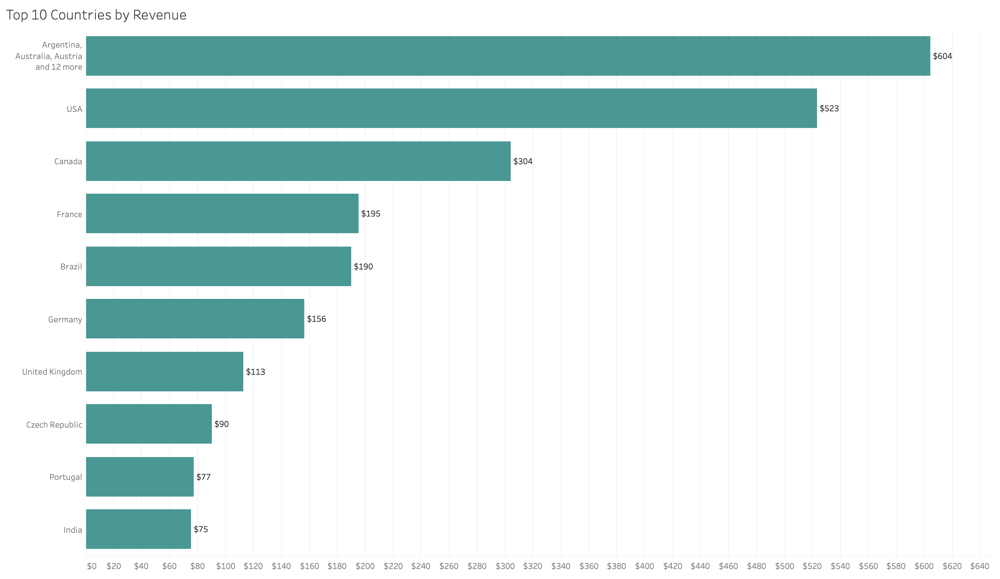
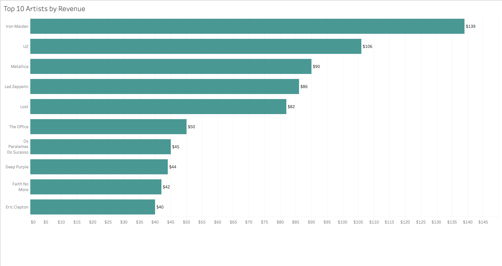
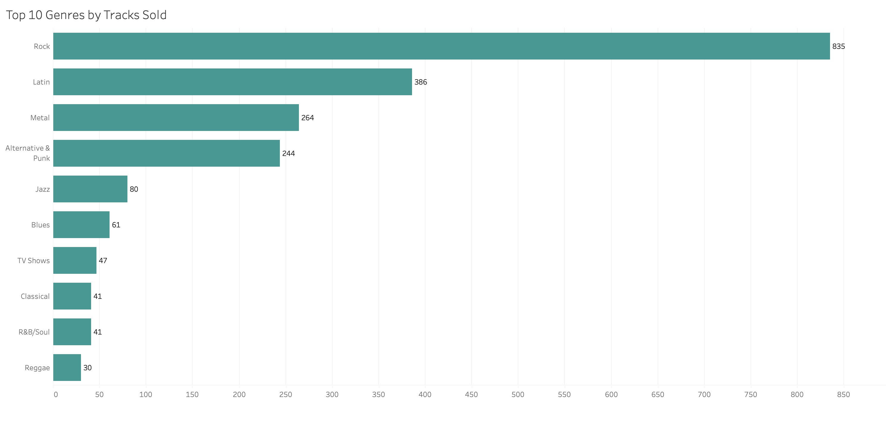
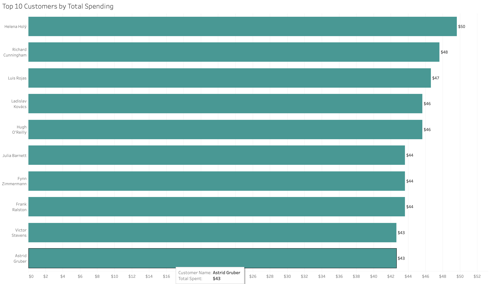
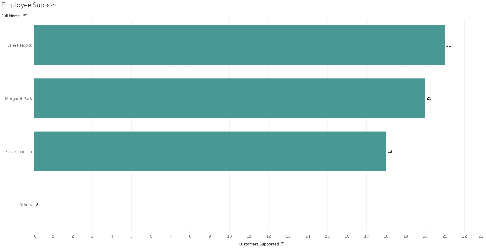

# 🎵 Chinook Database Analysis (SQL + Tableau)

## 📊 Overview
This project analyzes a digital music store database (Chinook) using SQL and Tableau to uncover customer behavior, revenue trends, and employee support.

## 🎯 Objectives
- Identify top customers by total spending
- Analyze revenue distribution across countries
- Determine best-selling artists and genres
- Evaluate employee support performance

## 🔧 Tools Used
- PostgreSQL (pgAdmin)
- SQL
- Tableau

## 📈 Key Analysis
- Customer spending analysis
- Revenue by country
- Top-selling artists
- Genre popularity
- Employee workload analysis

## 📁 Files
- `chinook_analysis.sql` → SQL queries
- `chinook_dashboard.twbx` → Tableau Dashboard
- `top_customers.png` → Top customers by spending
- `most_sold_genres.png` → Top genres by tracks sold
- `revenue_by_country.png` → Revenue by country 
- `revenue_by_artist.png` → Revenue by artist
- `employee_support.png` → Customers supported by each employee
## 💡 Key Insights
- Customer spending is relatively evenly distributed 
- Certain countries, such as the US and Canada, dominate sales 
- Specific genres and artists consistently perform better
- Only three employees actively support customers
- Among active employees, workload is relatively balanced

## 📊 Dashboard & Visualizations Preview
### Revenue by Country

### Revenue by Artist

### Most Popular Genres

### Top Customers

### Employee Support

 
